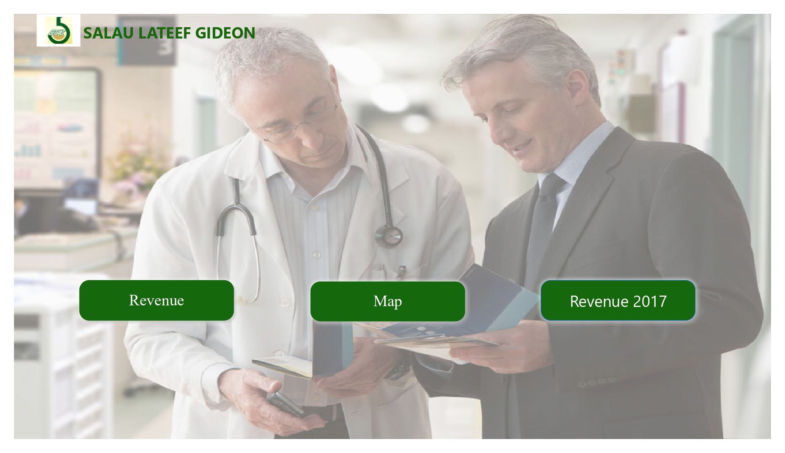
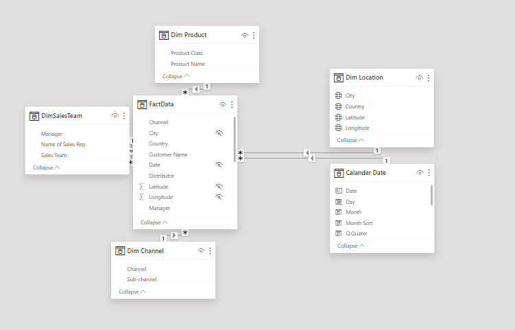
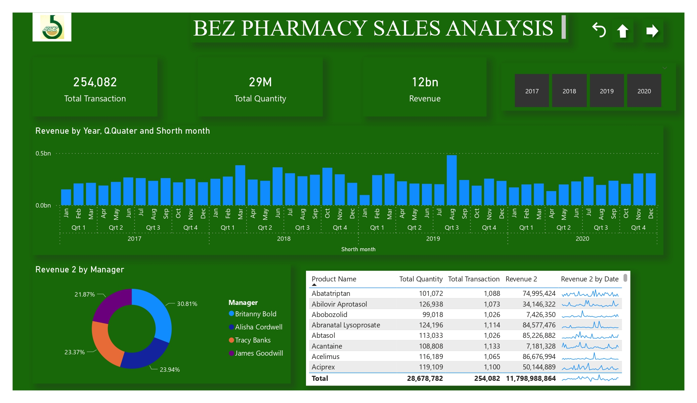
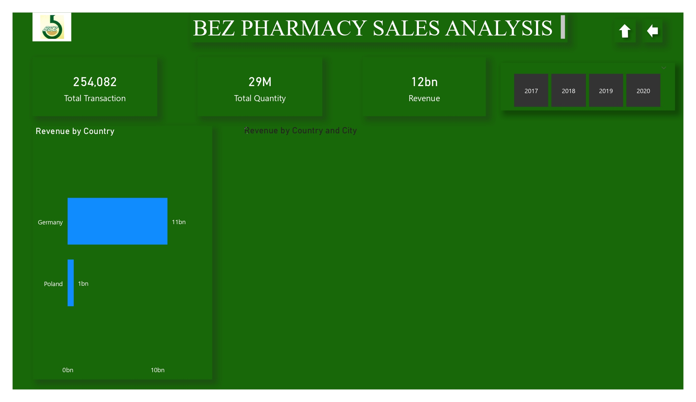

# Bez_Pharmacy Sales Analysis

## Introduction

This is a power BI project on sales analysis of an imagerinary store called **Bez Pharmacy**.
The project is to analyze and derive insights to answer crucial questions and help the store make data driven decions

**_Disclaimer_** : _All dataset and reports do not represent any company, institution or country, but just a dummy dataset gotten online to demonstate the capabilities of Power BI._

## Problem Statement 
1. What is our total revenue over the cost of 4 years
2. What is the total quantity of product product sold during this period
3. Who are the top performing manager
4. What is the total revenue by country and city

## Skills / Concept demonstrated

The following Power Bi features were incoporated: 
- Bookmarking
- DAX
- Quick Measure
- Time Inteligence
- Modelling
- Filters
- Tooltips
- Button

## Modelling 
Automatically derived relationships are adjusted to remove and replace unwanted relationships with the required. 

The model is a star schema
There are 5 dimension tables and 1 fact  table. The dimension tables are joined to the fact table with a one-to-many relationship

## Visualization

The report comprises of 3 pages
- Menu page
- Revenue Summary
- Map

You can interact with the report here: [https://app.powerbi.com/links/dvoGoMnuHC?ctid=5017df77-c053-4434-b3e8-e80403c4a2c2&pbi_source=linkShare]

#### Revenue summary :

It appears that Bez pharmacy had 254,082 transactions
29 million quantity of product sold
12 billion revenue generated

#### Map :

Germany is recorded to have the highest sales 11 billion
Poland is the next with 1 billion revenue generated

## Conclusion and Recommendation
Germany generated the highest revenue so, there is need for aggressive marketing in Poland and also Germany should also be looked into so as to increase sales.

**_Disclaimer_** : I have not really explore the insight derived from this dataset as I am doing this documentation couple of months after visualization.

THANK YOU 😄

Chat me up on Linkedln: http://linkedin.com/in/salau-gideon-ond-aat-bsc-and-aca-in-view-330a4a1a0

Twitter: @LateefGideon

Whatsapp: 08100657265

